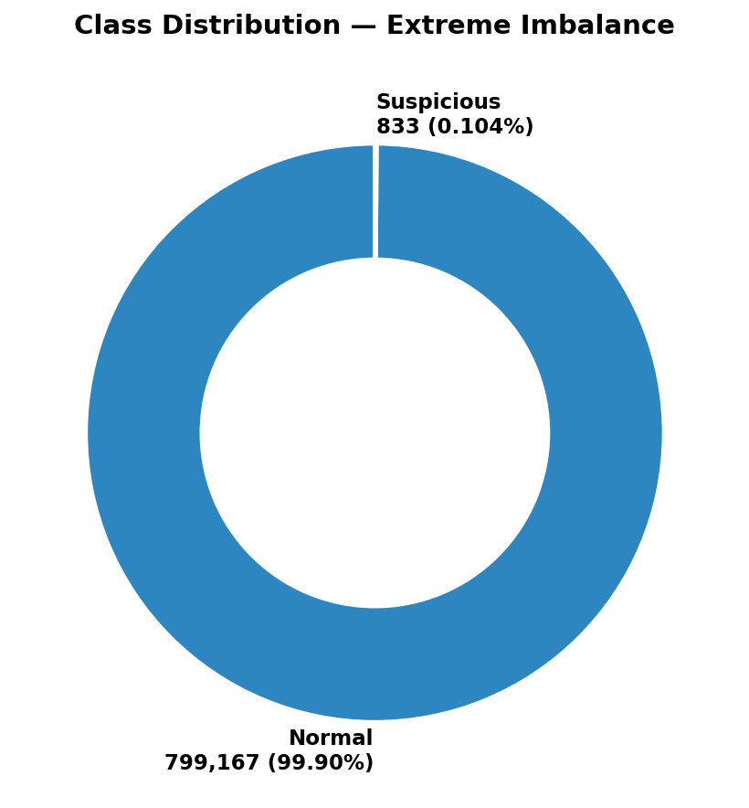
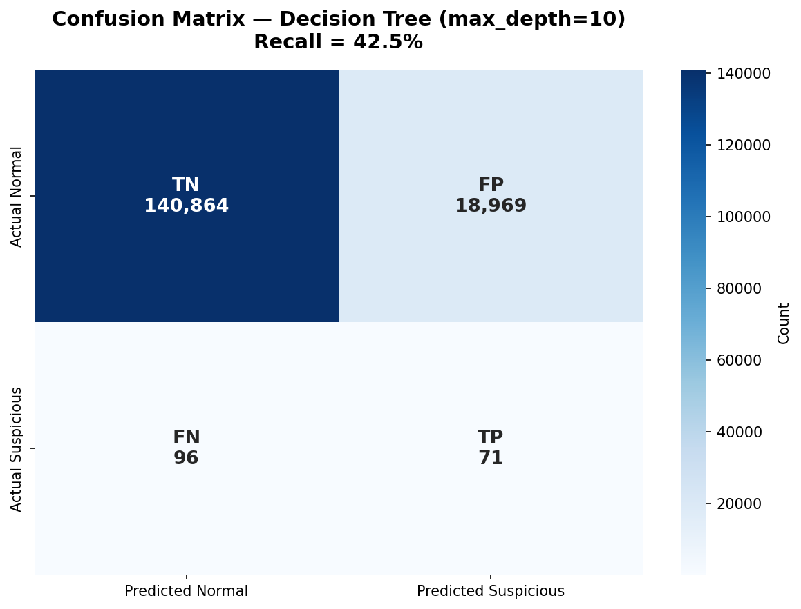
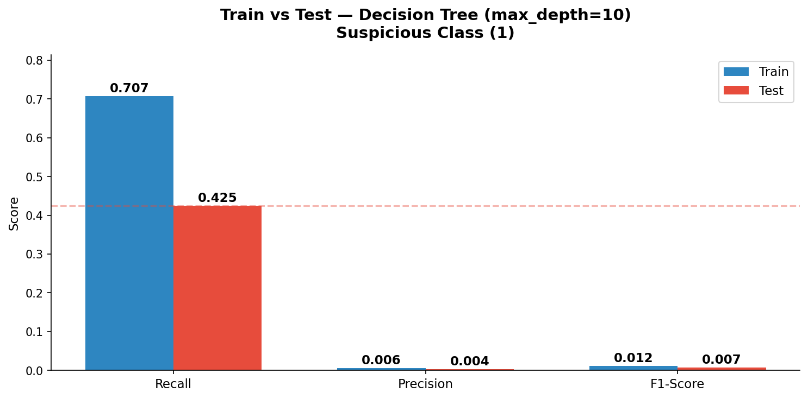
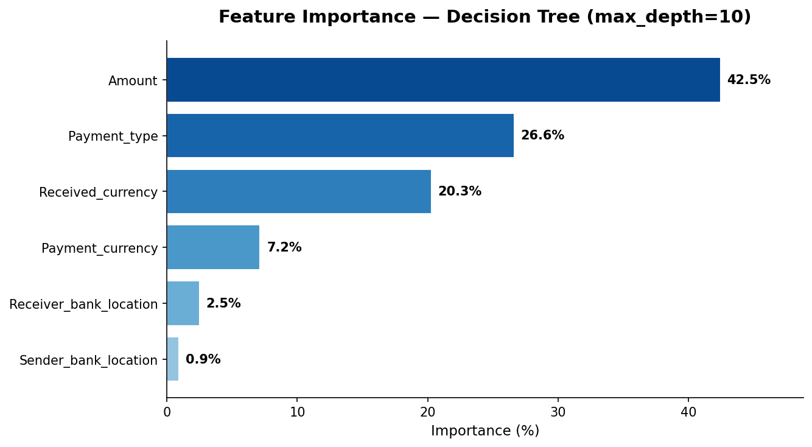

# AML Detection — Jedha Bootcamp Final Project

> **Building a Machine Learning model to detect suspicious transactions (Anti-Money Laundering — AML).**

[](https://www.python.org)
[](https://scikit-learn.org)
[](https://jupyter.org)

📓 **Read the notebook online (no setup needed):**
[](https://colab.research.google.com/github/nashcastillo/aml-detection-saml-d/blob/main/aml_detection_saml_d_en.ipynb)
[](https://nbviewer.org/github/nashcastillo/aml-detection-saml-d/blob/main/aml_detection_saml_d_en.ipynb)

🇫🇷 *Version française disponible : [README.fr.md](README.fr.md)*

## 👥 Team

Project completed during the **Data Essentials — Jedha Bootcamp** training program (April 2026).

- **Nashely Castillo** — AML Compliance Officer (business framing, EDA, modeling)
- **Gwladys Pioche** — Exploratory data analysis
- **Robin Pradier** — Machine Learning modeling

---

## 🎯 Project question

> **Can we predict whether a transaction is potentially related to money laundering?**

The goal is not to certify that a transaction is suspicious, but to **flag a risk** in order to reduce the workload of human analysts.

### Context

In 2024, **TRACFIN** (the French anti-money laundering authority) received **215,410 suspicious activity reports**, but only **3,998** were forwarded to the judiciary — that is, **about 98% false positives**. Can Machine Learning improve this ratio?

---

## 📊 The dataset — SAML-D

- **Source**: [BOztasUK/Anti_Money_Laundering_Transaction_Data_SAML-D](https://github.com/BOztasUK/Anti_Money_Laundering_Transaction_Data_SAML-D)
- **Original size**: 9,504,852 transactions
- **Working sample**: **800,000 rows** (distribution preserved)
- **Target variable**: `Is_laundering` (0 = normal / 1 = suspicious)
- **Imbalance**: only **0.1%** suspicious transactions (833 cases)



| Category | Variables |
|---|---|
| **Time & Amount** | Date, Time, Amount |
| **Accounts** | Sender_account, Receiver_account |
| **Location** | Sender_bank_location, Receiver_bank_location |
| **Payment** | Payment_type, Payment_currency, Received_currency |
| **Target** | Is_laundering, Laundering_type |

---

## 🧪 Methodology

```
1. EDA          → Exploration & visualization (imbalance, countries, typologies)
2. Preprocessing → LabelEncoder, StandardScaler, stratified train/test, class_weight balanced
3. Modeling      → 5 models tested (Logistic Regression × 3, Decision Tree, Random Forest)
4. Evaluation    → Recall as the key metric (in AML, a false alert is better than a missed launderer)
```

---

## 🤖 Models tested & results

| # | Model | Configuration | Recall (test) | Status |
|---|---|---|---|---|
| 1 | Logistic Regression | `X = Amount` only | 0% | ❌ Unusable |
| 2 | Logistic Regression | + `class_weight='balanced'` | 22% | Weak |
| 3 | Logistic Regression | + 6 features | 38% | Average |
| 4 | **Decision Tree** | `max_depth=10`, balanced | **43%** | ⭐ **SELECTED** |
| 5 | Random Forest | 100 trees, `max_depth=15` | 13% | Drop |

### Selected model: Decision Tree (max_depth=10)



**Recall = TP / (TP + FN) = 71 / (71 + 96) ≈ 43%**

### Train vs Test — overfitting check



The recall drops from 0.71 (train) to 0.43 (test) — moderate overfitting. Precision and F1 stay extremely low because of the 0.1% class imbalance: most flagged transactions are false positives. This is why we **focus on recall**, not precision, for AML detection.

### Feature importance



---

## 🚀 Reproduce the project

### 1. Clone the repo

```bash
git clone https://github.com/nashcastillo/aml-detection-saml-d.git
cd aml-detection-saml-d
```

### 2. Install dependencies

```bash
pip install -r requirements.txt
```

### 3. Get the dataset

The full file (~84 MB, 800,000 rows) is **not included** in the repo (GitHub limit). Two options:

- **Option A**: download the original dataset from [BOztasUK/Anti_Money_Laundering_Transaction_Data_SAML-D](https://github.com/BOztasUK/Anti_Money_Laundering_Transaction_Data_SAML-D) and generate an 800k-row sample
- **Option B**: use the small sample `data/SAML-D_sample_1k.csv` (1,000 rows) included in the repo to test the pipeline

### 4. Run the notebook

```bash
jupyter notebook aml_detection_saml_d_en.ipynb
```

📓 Available notebooks:
- **`aml_detection_saml_d_en.ipynb`** — English version
- **`aml_detection_saml_d.ipynb`** — French version

---

## 🎯 Improvement areas

| # | Area | Technique | Expected impact |
|---|---|---|---|
| 1 | Resampling | **SMOTE** | Recall ↑ |
| 2 | Feature engineering | Temporal & behavioral patterns | Recall & Precision ↑ |
| 3 | Model | **XGBoost** | Overall score ↑ |
| 4 | Calibration | Decision threshold tuning | Precision ↑ |

---

## 📚 Sources

- **Europol (2017)** — *From suspicion to action: Converting financial intelligence into greater operational impact*
- **TRACFIN (2024)** — Annual activity report
- **SAML-D Dataset** — Oztas, B. (2023)

---
